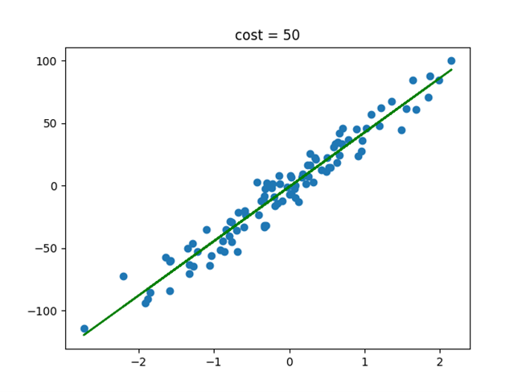
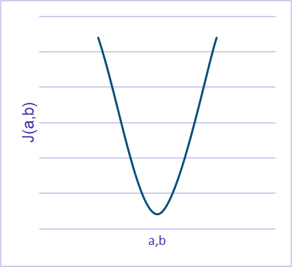

# Find the optimal model using the gradient descent algorithm

in this code we will take any dataset with one feature and one target and try to find their optimal linear model, and minimize the cost of this linear model using the gradient descent algorithm.

<p align="center">
  
</p>

# Prerequisites

after all make sure that you have already install the folowing libraries:

- matplotlib
```
pip install matplotlib
```
-  sklearn 
```
pip install sklearn 
```
- numpy 
```
pip install numpy 
```

# THEORY
## **LINEAR MODEL** 
For linear regression, we use the Euclidean norm to measure the errors between 𝒇(𝒙) and (𝒚). Concretely, here is the formula to express the error E between the 𝒚(𝒊) and the prediction .
From the collected Dataset, we can develop a linear model of the type:
```
    f(x)= ax + b        Where 𝒂 and 𝒃 are the model parameters.
```
A good model gives small errors between its predictions 𝒇(𝒙) and the examples (𝒚) of the Dataset. 
We do not know the values of the parameters 𝒂 and 𝒃, it will be the role of the machine to find them using the gradient descent, so as to draw a model that fits well in our point cloud.
## **COST FUNCTION**
For linear regression, we use the Euclidean norm to measure the errors between 𝒇(𝒙) and the model 𝒚.


Each prediction comes with an error, so we have 𝒎 errors. We define the Cost Function 𝑱(𝒂,𝒃) to be the average of all errors:


The cost function is a square function so the appearance of this function can take the following form:
<p align="center">
  
</p>
To find the minimum, we can use several methods based on derivate the cost function  𝑱(𝒂,𝒃), among the most popular algorithm used is The Gradient Descent

## **THE GRADIENT DESCENT**
This algorithm allows to find the minimum of the cost function 𝑱(𝒂, 𝒃) from random coordinates a0 and b0:

- Calculate the slope of the Cost Function, so derive J(a,b) at points a0 and b0
- Move a certain distance ∝ in the direction of the steepest slope. This results in changing the parameters 𝒂 and 𝒃
- Repeat steps 1 and 2 until you reach the minimum of 𝑱(𝒂, 𝒃).
We can conclude this algorithm in the following recursive function:
<p align="center">
  
</p>

# CODE

- create a random linear regression dataset

```
x, y = make_regression(n_samples= 100, n_features=1, noise = 10)  
y  = y.reshape(100,1)                # target (100,1)  
X = np.hstack((x, np.ones(x.shape))) # les features (100,2)  
```
- chose a random iniitial parametre a0 and b0
```
theta  = np.random.randn(2,1)        # valeur initiale random des parametres a et b /tetha = (a,b)    
```
<p align="center">
  
</p>
- create a random linear regression dataset

```

# Author

* **Ahmed Jellouli** - *ELECTRICAL ENGINEERING STUDENT INTERESTED IN DATA ANALYSIS*

# License

This project is licensed under the MIT License - see the [LICENSE](LICENSE) file for details


